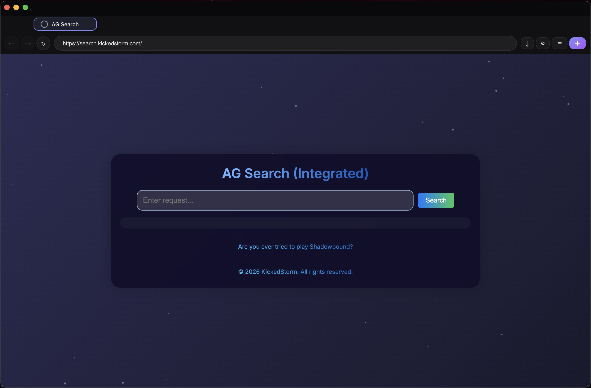

# AG Browser

> **A blazing-fast, privacy-respecting, open-source web browser.**

AG Browser is a lightweight, cross-platform web browser built on Electron. Designed to offer a seamless and distraction-free browsing experience, it puts performance and user privacy first — without compromising on extensibility or design.

## Preview



---

## 💨 Quick start

```bash
git clone https://github.com/XS-Corp/ag-browser
cd ag-browser
npm install
npm start
```

---

## 🚀 Key Features

- **No Tracking** – AG Browser does not collect telemetry, usage analytics, or personal data.
- **Cross-Platform** – Runs on macOS, Windows, and Linux with identical functionality.
- **Custom UI/UX** – Minimalist interface with theming support and optional translucency.
- **Ad-Free by Design** – No ads, no sponsored content, and no hidden banners.
- **Fast and Lightweight** – Optimized Electron core with minimal resource overhead.
- **Open Architecture** – Clean, modular codebase built for extensibility and tinkering.
- **Built-in Developer Tools** – For those who want to debug, extend, or integrate.

---

## 🔐 Philosophy

- **Privacy-first**: No silent data collection. Ever.
- **Speed-focused**: Fast startup, and minimal memory usage.
- **User-controlled**: Everything is tweakable. No locked settings.
- **Open-source**: Built by developers, for developers.

---

## 🛠️ Project Status

AG Browser is under active development. Current efforts are focused on:

✅ Tab management with custom visuals
✅ Native download handler
✅ Theming engine
- AG AI integration (optional assistant)
✅ Plugin system for extensions

---

## 🧠 Built With

- [Electron](https://www.electronjs.org/)
- [Node.js](https://nodejs.org/)
- [HTML/CSS/JS] – For custom UI components

---

## 👨‍💻 Maintainer

Made with passion by [KickedStorm Studios](https://github.com/XS-Corp)

Feel free to fork, contribute, or suggest improvements.

---

## ⚠️ Warning

AG Browser tested only on ARM64 macOS and can be unstable on other platforms.

---


## 📄 License

This project is licensed under the [MIT License](./LICENSE)

> AG Browser — because your browser should work *for you*, not against you.

© 2026 KickedStorm. All rights reserved.